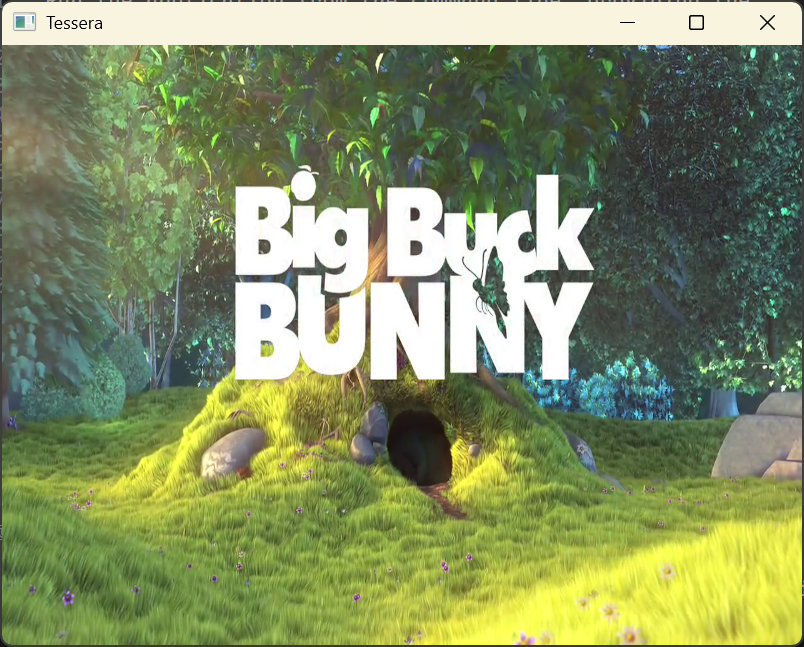

# Prism Player

Prism Player is a simple, lightweight video player built with Rust and the [`tessera-ui`](https://github.com/tessera-ui/tessera) framework. It uses FFmpeg for video decoding.



## Features

- Playback of local video files.
- Simple play/pause control by clicking anywhere on the video.
- Modern, fluid UI elements.

## Prerequisites

Before you begin, ensure you have the following installed:

- [Rust](https://www.rust-lang.org/tools/install)
- [FFmpeg](https://ffmpeg.org/download.html). Make sure the FFmpeg libraries are accessible to the linker.

## Building and Running

1. **Clone the repository:**

    ```bash
    git clone https://github.com/your-username/prism-player.git
    cd prism-player
    ```

2. **Build the project:**

    ```bash
    cargo build --release
    ```

3. **Run the player:**

    ```bash
    ./target/release/prism-player --video-path /path/to/your/video.mp4
    ```

## Usage

Run the application from the command line, providing the path to the video file you want to play.

```bash
prism-player --video-path <path-to-video>
```

### Controls

- **Click anywhere on the window:** Toggle play/pause.
